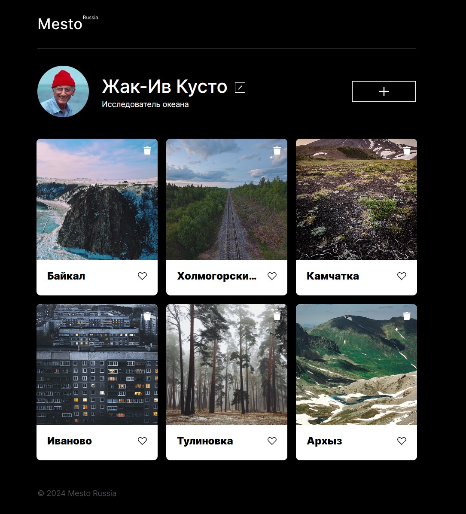

# Проект 4: Место

### Что требовалось

**Работа модальных окон**
1. Форма редактирования профиля пользователя
2. Форма добавления карточки
3. «Лайк» карточки
4. Удаление карточки
5. Открытие и закрытие поп-апа с картинкой

## Технологии

* HTML
* CSS
* JavaScript

## Ссылка на проект

https://pharrower.github.io/Yandex__mesto-project/
